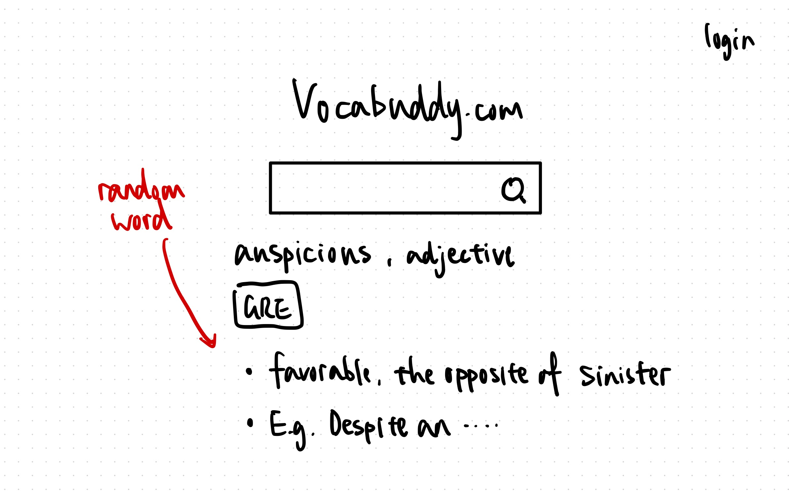
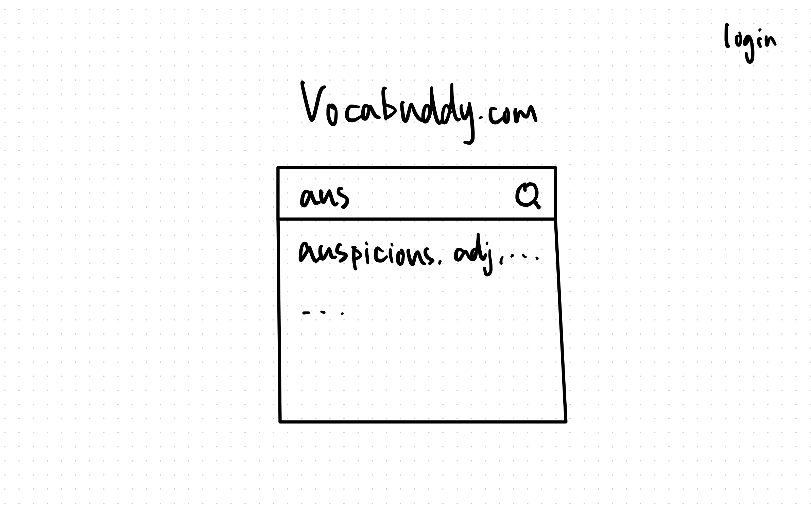
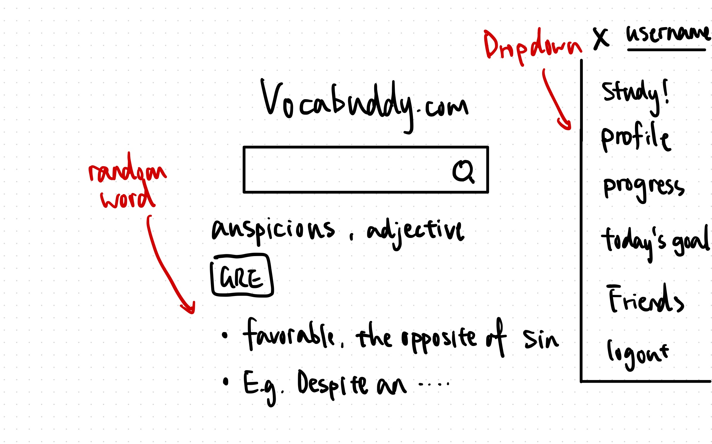
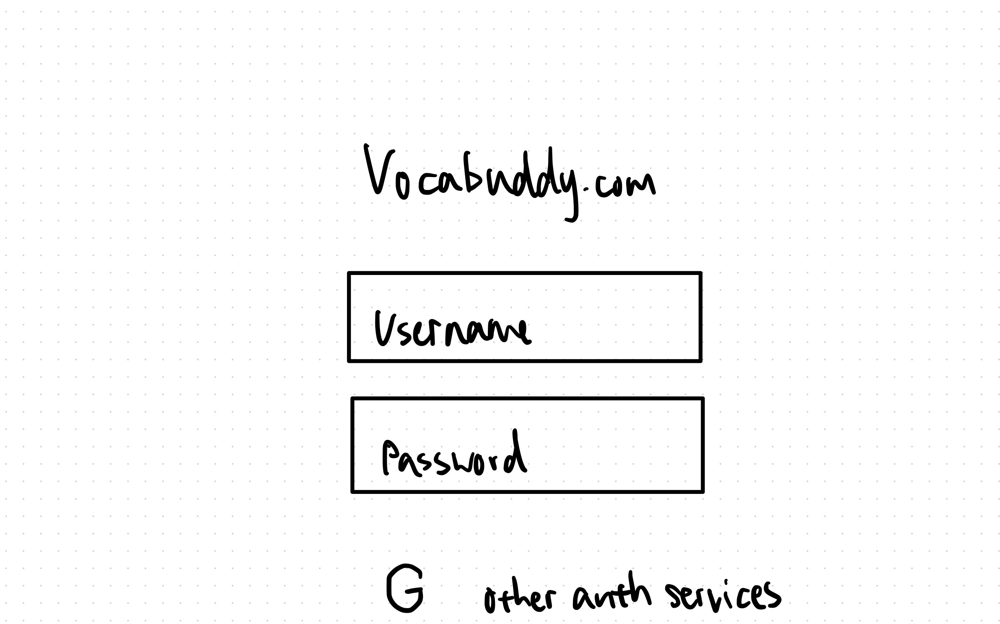
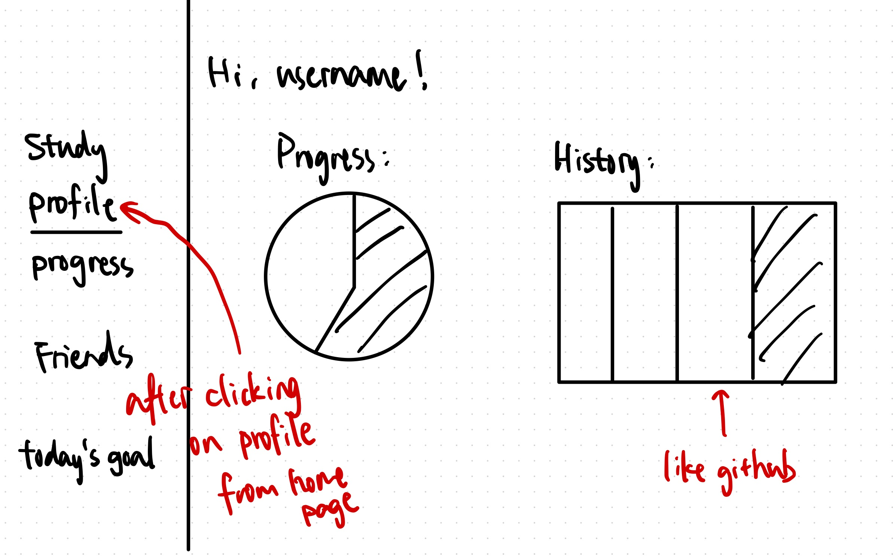
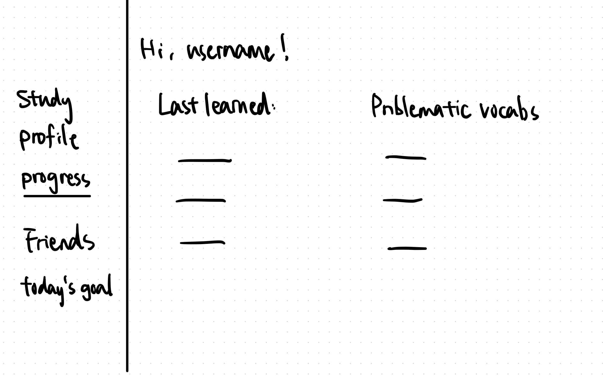

# Project Proposal 

### 1. Project Name: Vocabuddy

### 2. Project Summary:  
We are trying to develop web-based application called Vocabuddy specifically designed for learners preparing for standard tests such as ACT, SAT, and GRE. The design is focused on mastering the extensive vocabulary required for the exam. This application offers a streamlined, browser-accessible approach to vocabulary learning, removing the need for cumbersome app downloads. On top of providing dictionary like services, Vocabuddy encourages users to personalize their study plans with test-specific goals, prompting a series of interactive exercises, quizzes, and learning tools designed to master the exam's challenging vocabulary section.

Vocabuddy includes features for tracking vocabulary progress in real-time, which will allow learners to have a visual understanding of their mastery of words. Furthermore, Vocabuddy encourages a collaborative study environment, where users can connect, share progress, and challenge each other on GRE vocabulary quizzes. By leveraging search algorithms, the platform also offers personalized vocabulary recommendations based on study history and other parameters, ensuring learners are focusing on the most relevant and important words for the test. The ultimate goal is to make the verbal preparation of GRE tobe engaging, manageable, and effective.

### 3. Description of an application of your choice. State as clearly as possible what you want to do. What problem do you want to solve, etc.?

The complex vocabulary is one of the most significant challenges that students preparing for standard tests, either domestic or international, will face. As the words are more academic and formal, it can be hard to memorize. In this case, the traditional study methods can be inefficient and isolating, making the preparation process discouraging and tough.

Our application is trying to solve these problems by building an interactive and convenient study environment for the students. The platform aims to make learning more engaging and accessible, making the task of vocabulary expansion into a manageable and pleasant part of exam preparation.

### 4. What would be a good creative component (technically challenging function) that can improve the functionality of your application? (What is something cool that you want to include? How are you planning to achieve it?)

One interesting element that is still a brainchild of us is that we want to build a minor recommendation system on some part of the front page. This could be based on the categories or similarities of the words which usually are not accessible when retrieving the data, or be based on the study history of the students to prompt words to be reviewed or studied next. Learning new words requires a lot of repetitions, and Vocabuddy intelligently suggests the next word to review. 

### 5. Usefulness. Explain as clearly as possible why your chosen application is useful. What are the basic functions of your web application? (What can users of this website do? Which simple and complex features are there?). Make sure to answer the following questions: Are there any similar websites/applications out there?  If so, what are they, and how is yours different?

The basic functions of our application include flashcard reviews, customizable quizzes, and progress tracking. We would have clear visualization for the user displaying what they have completed, and how their work are distributed across the time line. We will give users maximum freedom in setting up quizzes, it can be based on time, frequency of mistaks or other possible features.

Though there are similar vocabulary lists that can be found on Magoosh or platforms like Quizlet, Vocabuddy holds several merits that differentiates itself. The application provides users with a delicate progess check function. Uses are also able to add friends with others, involving the elements of interaction and competition that provides motivation. The intelligent study recommandation will personalize learning at a granular level. These functions will help users to prepare more effectively for the GRE but and also making the process more motivating. Besides, it also provides easy access for vocabulary lookup that other platforms does not provide.

### 6. Realness. We want you to build a real application. So, make sure to locate real datasets. Describe your data sources (Where is the data from?)

We can easily find vocabulary words specific to all standard tests like GRE on Quizlet. The quizlet study sets are of various lengths up to 2000. The Quizlet website supports directly downloading a set of words in `.csv` format. We can then construct our databases from these files. The provided data on Quizlet includes the words as well as its definition. Our main effort will be contributed to selecting data of good quality and processing it afterwards. Moreover, we can call an API to fetch more definitions of a specific word if needed.

### 7. A detailed description of the functionality that your website offers. This is where you talk about what the website delivers. Talk about how a user would interact with the application (i.e., things that one could create, delete, update, or search for). Read the requirements for stage 4 to see what other functionalities you want to provide to the users. You should include:
- A low-fidelity UI mockup: What do you imagine your final application’s interface might look like? A PowerPoint slide or a pencil sketch on a piece of paper works!
    - 
    - 
    - 
    - 
    - 
    - 
- Project work distribution: Who will be responsible for each of the tasks or subtasks?
Explain how backend systems will be distributed across members. Be as specific as possible as this could be part of the final peer evaluation metrics.
    1. Backend: Populating our own database (will always collaborate as a team)
        1. Data source lookup - Joanne, Erika
        2. Download, then cleanse data - Joanne, Erika
        3. Database relations design - Group discussion
            1. words
            2. users
            3. user_history
        4. Database Setup  - Joanne, Erika
        5. Actually populating our database - Joanne, Erika
    2. Front-end UI
        1. Jack
        2. Weiyang
    3. Deployment and misc
        1. Jack