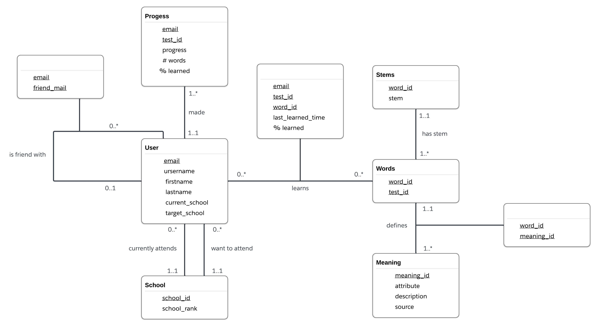

# Conceptual Database Design
### Project Name: Vocabuddy

### 1. Initial UML Diagram
#### Before Normalization


### 2. Assumptions
#### 2.1 Entities
1. `User`
    1. Users have unique emails and cannot be modified
    2. There could only be one school that a user currently attends
    3. There could only be one target school that a user plans to attend
    4. Users can have the same username as they are just for display
2. `Progress`
    1. Users can have different progress for vocabulary of different tests (E.g., GRE, ACT, SAT). For simplicity, a vocabulary set refers to vocabulary of a single test.
    2. Number of words learned in the progress cannot exceed the total number of words in that vocabulary set
3. `School`
    1. School ranking can have duplicates
    2. School rankings cannot exceed the total number of schools
4. `Words`
    1. A word can appear across different vocabulary sets 
5. `Stems`
    1. Multiple words can have the same stem
    2. A word can have exactly a single stem
6. `Meaning`
    1. A word can have multiple meanings
    2. Each meaning can have different PartOfSpeed
    3. Each meaning must be from a reputable source

#### 2.2 Relations

1. `IsFriendWith`
    1. A user can have multiple friends
    2. A user can have no friends
2. `Made`
    1. A user can have a progress for each vocabulary set
    2. A progress must be linked back to exactly a single user
3. `CurrentlyAttends`
    1. There could only be one school that a user currently attends
    2. Many users can attend a single school
4. `WantsToAttend`
    1. There could only be one target school that a user plans to attend 
    2. Many users can share a single target school
5. `Learns`
    1. LastLearnedTime will always be updated in a timely manner and cannot be more advanced than current time
    2. PercentLearned can increase or decrease with time
6. `HasStem`
    1. Explained above
7. `Defines`
    1. Explained above

### 3. UML Requirements
1. We have 6 entities and 7 relations.
2. We have many-to-many and one-to-many relations.

### 4. BCNF vs 3NF
#### 4.1 Functional Dependencies in Entities
1. `User`: 
    - `Email → Password, Username, FirstName, LastName`
    - Therefore needs to split it with an additional table `Education(Email, CurrentSchool, TargetSchool)`
2. `Progress`
    - No functional dependency between `Email, TestId, NumWordsLearned`
3. `School`: `SchoolId → SchoolRank`, already satisfies 3NF
4. `Words`: No functional dependency between `WordId` and `TestId`
5. `Stems`: `WordId → Stem`, already satisfies 3NF
6. `Meaning`: No functional dependency between `MeaningId, PartOfSpeech, Description, Source`

#### 4.2 Functional Dependencies in Relations
1. `IsFriendWith`: No functional dependency between `Email` and `FriendEmail`
2. `Learns`: No functional dependency between `Email, TestId, WordId, LastLearnedTime, PercentLearned`
3. `Defines`: No functional dependency between `WordId` and `MeaningId`

#### 4.3 Why 3NF
After normalization, the database follows 3CNF, as there are no transitive dependencies in the schema. The reason we think 3NF is more suited for our project is as follows:
1. BCNF is stricter than 3NF, but our project is simple and does not benefit from having stricter rules
2. BCNF may sometimes lead to more complex database designs due to its strictness. 
3. 3NF preserves dependencies. 

#### 4.4 Updated UML:


#### 5. UML to Logical Design
```
User(
    Email:      VARCHAR(255) [PK],  
    Password:   VARCHAR(255), 
    Username:   VARCHAR(255),  
    FirstName:  VARCHAR(255),  
    LastName:   VARCHAR(255), 
    CurrentSchool:  VARCHAR(255) [FK to School.SchoolId],
    TargetSchool:   VARCHAR(255) [FK to School.SchoolId]
    )

IsFriendWith(
    Email:         VARCHAR(255) [FK to User.Email] [part of PK], 
    FriendEmail:   VARCHAR(255) [FK to User.Email] [part of PK]
    )

School(
    SchoolId:   VARCHAR(255) [PK],  
    SchoolRank: INT
    )

Progress(
    Email:              VARCHAR(255) [FK to User.Email],  
    TestId:             INT [FK to Words.TestId],  
    NumWordsLearned:    DECIMAL 
    )

Learns(
    Email:  VARCHAR(255) [FK to User.Email], 
    TestId: INT [FK to Words.TestId], 
    WordId: INT [FK to Words.WordId], 
    LastLearnedTime:    TIMESTAMP, 
    PercentLearned:     DECIMAL
    )

Words(
    WordId: INT [PK (consists of two columns)],  
    TestId: INT [PK (consists of two columns)],
    Stem:   VARCHAR(255)
    )

Meaning(
    WordId: INT [FK to Words.WordId (consists of two columns)],  
    TestId: INT [FK to Words.TestId (consists of two columns)],
    PartOfSpeech:   VARCHAR(255), 
    Description:    TEXT, 
    Source:         VARCHAR(255)
    )
```
