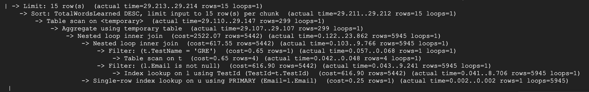

# Database Design
### Changes made in Stage 2
- Merged Stem into Words due to many-to-one relation. 
- Merged defines into Meaning due to many-to-one relation. 
- Fixed foreign key issues.
- Updated UML diagram and table description.

### DDL commands 
```sql
CREATE TABLE School (
    SchoolId INT PRIMARY KEY,
    SchoolName VARCHAR(255),
    SchoolRank INT NOT NULL,
    Country VARCHAR(20),
    Size VARCHAR(5),
    Score INT NOT NULL
);

CREATE TABLE User (
    Email VARCHAR(255) PRIMARY KEY,
    Password VARCHAR(255) NOT NULL,
    FirebaseUID VARCHAR(255),
    Username VARCHAR(255) UNIQUE NOT NULL,
    FirstName VARCHAR(255) NOT NULL,
    LastName VARCHAR(255) NOT NULL,
    JoinedTime TIMESTAMP DEFAULT CURRENT_TIMESTAMP,
    TargetSchoolId INT,
    FOREIGN KEY (TargetSchoolId) REFERENCES School(SchoolId)
);

CREATE TABLE IsFriendWith (
    Email VARCHAR(255),
    FriendEmail VARCHAR(255),
    PRIMARY KEY (Email, FriendEmail),
    FOREIGN KEY (Email) REFERENCES User(Email),
    FOREIGN KEY (FriendEmail) REFERENCES User(Email)
);

CREATE TABLE Tests (
    TestId INT PRIMARY KEY,
    TestName VARCHAR(255) NOT NULL
);

CREATE TABLE Words (
    WordId INT,
    Word VARCHAR(255),
    TestId INT,
    Stem VARCHAR(255) NOT NULL,
    FOREIGN KEY (TestId) REFERENCES Tests(TestId),
    PRIMARY KEY (WordId, TestId)
);

CREATE TABLE Learns (
    Email VARCHAR(255),
    TestId INT,
    WordId INT,
    LastLearnedTime TIMESTAMP NOT NULL,
    PercentLearned INT NOT NULL,
    FOREIGN KEY (Email) REFERENCES User(Email),
    FOREIGN KEY (TestId, WordId) REFERENCES Words(TestId, WordId)
);

CREATE TABLE Meaning (
    WordId INT,
    TestId INT,
    PartOfSpeech VARCHAR(255) NOT NULL,
    Description VARCHAR(2048) NOT NULL,
    Example VARCHAR(2048),
    Source VARCHAR(255) NOT NULL,
    FOREIGN KEY (WordId, TestId) REFERENCES Words(WordId, TestId)
);
```

### Deployed on GCP


### Table sizes


### Advanced SQL queries
1. Leaderboard: Displays the top 15 users with the highest total number of words learned for specific test
    ```sql
    SELECT u.Username, t.TestName, COUNT(*) AS TotalWordsLearned
    FROM User u
    JOIN Learns l ON u.Email = l.Email
    JOIN Tests t ON l.TestId = t.TestId AND t.TestName = 'GRE'
    GROUP BY u.Username, t.TestName
    ORDER BY TotalWordsLearned DESC
    LIMIT 15;
    ```
    
   
2. Users' weak words comparing to peers: find words that a specific user has learned less effectively compared to the average learning performance of all users on those same words.
    ```sql
    SELECT DISTINCT W.WordId, W.Word, L.PercentLearned, AVG_L.AvgPercentLearned
    FROM Learns L
    JOIN Words W ON L.WordId = W.WordId AND L.TestId = W.TestId
    JOIN (
        SELECT WordId, TestId, AVG(PercentLearned) AS AvgPercentLearned
        FROM Learns
        GROUP BY WordId, TestId
    ) AVG_L ON L.WordId = AVG_L.WordId AND L.TestId = AVG_L.TestId
    WHERE L.Email = 'josephwashington201@example.com'
    AND L.PercentLearned < AVG_L.AvgPercentLearned
    LIMIT 15;
    ```
    


3. User Progress Comparison: Finds peers who have learned more words than the current user in a specific test
    ```sql
    SELECT u.Username, COUNT(*) AS TotalWordsLearned
    FROM User u
    JOIN Learns l ON u.Email = l.Email
    WHERE l.TestId = 0 AND l.Email != 'davidmacy195@example.com'
    GROUP BY u.Username
    HAVING COUNT(*) > (
      SELECT COUNT(*)
      FROM Learns
      WHERE Email = 'davidmacy195@example.com' AND TestId = 0
    )
    ORDER BY TotalWordsLearned DESC
    LIMIT 15;
    ```
    


4. Words with common stems: Find the words with same stem, identifying words that have the same base form or are derived from the same root word
    ```sql
    SELECT w1.Word AS Word1, w2.Word AS Word2, w1.Stem
    FROM Words w1
    JOIN Words w2 ON w1.Stem = w2.Stem AND w1.WordId < w2.WordId
    WHERE w1.Stem IN (
      SELECT Stem
      FROM Words
      GROUP BY Stem
      HAVING COUNT(DISTINCT WordId) >= 2
    ) and w1.TestId = 3
    ORDER BY Stem
    LIMIT 15;
    ```
    


## Indexing
### Pre-Indexing Performance
1. **Leaderboard: Displays the top 15 users with the highest total number of words learned for specific test**
   - 
   - The query executes a nested loop inner join between the `Learns` (l) and `User` (u) tables after conducting an initial inner join between `Learns` (l) and `Tests` (t) tables based on `TestId`, totaling a cost of 2522.07 and processing 5945 rows over 25.412 seconds, highlighting a significant but efficient data handling operation. The query starts with a swift filter on the `Tests` table for 'GRE' name, followed by an index lookup on `Learns` using `TestId`, ensuring only rows with non-null emails are considered. This setup leads to a single-row index lookup on `User` using the primary key `Email`, executed rapidly. Post-joins, data is aggregated into a temporary table for 299 rows, then sorted by `TotalWordsLearned` DESC, with the process tightly managed to limit output to the top 15 rows, ensuring efficient data processing and minimal execution time in final sorting and limiting stages.

2. **Users' weak words comparing to peers: find words that a specific user has learned less effectively compared to the average learning performance of all users on those same words.**
    - 
    - The query first scans the `Learns` table with a cost of 1112.55, handling 10997 rows in about 6.639 seconds. It uses an aggregate function with a temporary table to summarize this data into 1903 rows, processed rapidly. Subsequent operations involve deeper examination within a temporary structure: a table scan refines these results, and a materialization step retains them for further processing. The core of the query is a nested loop inner join starting with a filter on `L.WordId` and `L.TestId` being non-null, specifically focusing on rows tied to 'josephwashington201@example.com'. This yields 33 rows at a minimal cost and time. Each of these rows is linked via a primary index lookup to the `Words` (W) table. Another nested join filters `L.PercentLearned` based on average learning rates, using an index to fetch relevant comparison data. Ultimately, the query limits itself to processing only 15 unique rows after sorting and deduplication in the temporary table, finishing the task within 14.339 seconds, reflecting efficient management of data sorting and retrieval operations.<br><br>

3. **User Progress Comparison: Finds peers who have learned more words than the current user in a specific test**
   - 
   - The query initiates with a nested loop inner join between the `Learns` (l) and `User` (u) tables, featuring a substantial cost of 1823.76, primarily focusing on rows excluding a specific email ('davidmacy195@example.com') and ensuring `l.Email` is not null. This join processes 5928 rows, following an index lookup on `l` using `TestId` with a significant fetch time but effective use of indices, leading to quick, precise retrievals. The subsequent single-row index lookup on `u` using the primary key `Email` maintains efficiency with minimal cost. A filtering step confirms if the count from `Learns` exceeds the count determined by a subquery, leading to a temporary aggregation and then a final sort on `TotalWordsLearned` in descending order, capping the output at 15 rows after deduplication and efficient sorting, demonstrating effective data handling and retrieval within a tightly controlled process, culminating in a swift and efficient sorting and limiting stage.<br><br>
    
4. **Words with common stems: Find the words with same stem, identifying words that have the same base form or are derived from the same root word**
   - 
   - The query executes a nested loop inner join on two instances of the `Words` table (`w1` and `w2`), starting with an index lookup on `w1` using `TestId` 3, which quickly retrieves 1069 rows. This is followed by filtering on `w1.Stem` to ensure it matches a list of stems generated by a subquery. The filter's effectiveness is shown in reducing 1069 to 80 rows. A critical part of the query involves materializing a subquery that identifies distinct stems meeting certain conditions; this materializes 57 unique stems efficiently in 2.785 seconds. Post-materialization, the primary query sorts and groups to count distinct `WordId`s, efficiently narrowing down to specific stems. Once `w1` is filtered, the join condition on `w2` checks for matching stems where `w1.WordId` is less than `w2.WordId`, implementing a dynamic re-planned index range scan for each loop iteration. Overall, despite a high initial cost of 216497.24 and a broad scope of 72115 rows, the actual execution optimizes to only 15 results in 19.689 seconds, showcasing effective use of indexing, materialization, and filtering to manage data throughput and query complexity efficiently.<br><br>

### Index Report
1. **Leaderboard: Displays the top 15 users with the highest total number of words learned for specific test**<br>
   (1) Index on Learns(Email)
   
   
   (2) Index on Tests(TestName)
   

   (3) Index on User(Username)
   

   **Analysis**: <br>
   The indexes on User(Username) and Learns(Email) do not have any impact on the query's estimated costs. However, the index on Tests(TestName) provides a slight reduction in the estimated cost of the inner hash join (from 2522.07 to 2521.78) and the estimated cost of the nested loop inner join (from 617.55 to 617.25).<br>

   **Final Index Design**: <br> We choose the second indexing strategy (Index on Tests(TestName)) as it provides a reduction in the estimated costs of the inner hash join and the nested loop inner join.<br><br>
   
2. **Users' weak words comparing to peers: find words that a specific user has learned less effectively compared to the average learning performance of all users on those same words.** <br>
   (1) Index on Learns(Email)
   

   (2) Index on Learns(WordId)
   

   (3) Index on Learns(PercentLearned)
   

   **Analysis**:<br>
   Based on the experimentation, all three indexing strategies do not improve the query performance compared to the pre-indexing result. The estimated cost remains the same. The query already performs efficiently with a small number of rows and a relatively low cost. In addition, the join condition between the Words and Learns tables uses WordId and TestId, which already have high selectivity. <br>
   
   **Final Index Design**: <br>
   We do not apply any indexing strategy in this case since the performance does not significantly improve, and the initial query already performs efficiently with a relatively low cost.<br><br>

3. **User Progress Comparison: Finds peers who have learned more words than the current user in a specific test**
   (1) Index on Learns(Email)
   

   (2) Index on Learns(Email, TestId)
    

   (3) Index on User(Username)
    

    
   **Analysis**:<br> Based on the experimentation, all three indexing strategies do not improve the query performance compared to the pre-indexing result. The join condition uses Email, and the GROUP BY condition uses Username, which already have high selectivity. <br>

   **Final Index Design**: <br>
   We do not apply any indexing strategy in this case since the performance does not significantly improve.<br><br>

4. **Words with common stems: Find the words with same stem, identifying words that have the same base form or are derived from the same root word** <br>
   (1) Index on Word(Stem)
   

   **Analysis**:<br> The index on Words(Stem) significantly improves the query's performance. The query cost has been reduced from 216497.24 to 717.92. The index is effectively used for deduplication and matching rows based on the Stem condition, reducing the need for full table scans.
   
   **Final Index Design**: <br> We choose to index Words(Stem) since it significantly reduces the cost of the nested loop inner join from 216497.24 to 717.92. <br><br>

### Data sources:
- [Magoosh](https://www.kaggle.com/code/sarthakvajpayee/gre-high-frequency-clustering-similar-words/input?select=magoosh_1000.csv)
- [QS Ranking](https://www.topuniversities.com/world-university-rankings)
